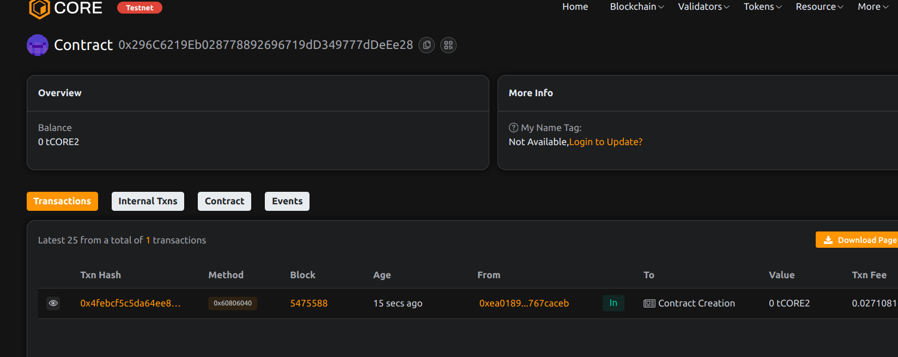

# KYCChain – Modular and Reusable KYC Identity Verification System

## 📄 Project Description
  
KYCChain is a decentralized smart contract that provides a secure and reusable on-chain KYC verification system. Designed for organizations and platforms that require trusted user identity verification, it ensures that identity data is accessible and auditable across multiple dApps without redundancy.

## 🎯 Project Vision

To become a unified standard for on-chain KYC that enables developers and organizations to verify and trust users through a single decentralized protocol, reducing costs, fraud, and data duplication.

## ✨ Key Featuress

- 🔒 On-chain user verification management
- 🧩 Modular architecture for easy integration
- 🧠 Metadata storage for enhanced identity profiling
- 👮 Admin-controlled verification and revocation
- 👁️ Transparent yet privacy-conscious design

## 🔮 Future Scope

- Integration with zero-knowledge proofs for enhanced privacy
- Cross-chain KYC registry for multi-network interoperability
- DAO governance to manage the admin role and verification policies
- Off-chain metadata validation oracles

## 📜 Contract Details
0x296C6219Eb028778892696719dD349777dDeEe28

